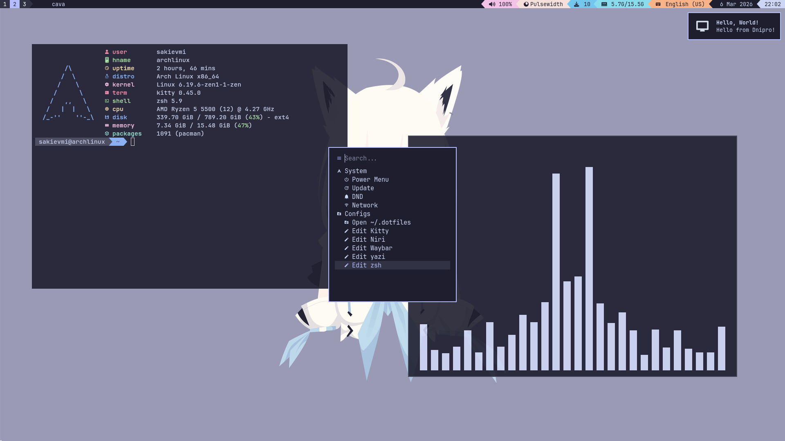
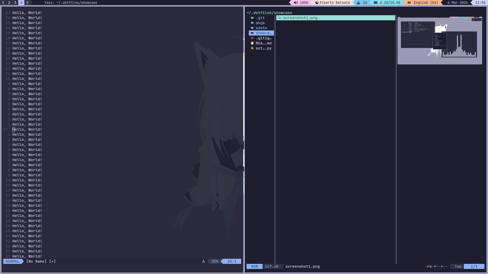

# 📦 My .dotfiles
This is my personal easy-to-install .dotfiles collection with a _pretty much_ pre-configured **environment**.


<b>Performance first</b>. No rounded corners and no heavy applications. Only lightweight and fast tools.
<br clear="left"/>


<b>CLI-centric workflow.</b> Everything stays in the terminal or looks like a terminal application. Even the image viewer feels like a terminal application.
<br clear="right"/>

### "Philosophy" behind my .dotfiles
I like the workflow of modern wayland compositors, but everyone (for some reason) wants these ugly rounded corners. I tried to make my configs as simple as possible to avoid any rounded elements.

And also i tried to use p10k style everywhere i could. It's just looks cool to me; there is nothing serious behind this decision.

---
### ⚠️ NOT A "USABILITY-FIRST" ⚠️
If you like my configs and want to use them, just fork my project and make changes for yourself. **I don't guarantee that my dots will work out of the box.**

But anyway, I accept any kind of help if you want to contribute.

---
### Stack
- **OS:** Arch Linux
- **WM (Compositor):** Niri
- **Shell:** zsh
- **Terminal:** kitty
- **Launcher:** fuzzel
# 🔃 Setup guide
1. Install requirements (`stow` and `yay`)
```bash
sudo pacman -Syu stow
```
and
```bash
sudo pacman -S --needed base-devel git
git clone https://aur.archlinux.org/yay.git
cd yay
makepkg -si
```
2. Clone this repository with this command:
```bash
git clone https://github.com/sakievmi-dev/dotfiles.git ~/.dotfiles
```
3. Run setup script in cloned repository
```bash
~/.dotfiles/setup.py setup
```
4. Optionally, but you can install additional packages
```bash
~/.dotfiles/setup.py install imv mpv
```

---
# 📌 Using my dots
## ⌨️ Main Hotkeys 
| Action | Keybinding |
| :--- | :--- |
| **System Menu** | `Mod + M` |
| **Show Keybinds** | `Mod + ?` |
| **App Launcher** | `Mod + Space` |
| **Open Terminal** | `Mod + Enter` |
| **Open Browser** | `Mod + B` |
| **Open File Manager** | `Mod + E` |
| **Move Focus** | `Mod + H/J/K/L` |
| **Move Window** | `Mod + Ctrl + H/J/K/L` |
| **Resize Column** | `Mod + =` / `-` |
| **Close Window** | `Mod + Q` |
| **Toggle Floating** | `Mod + V` |
| **Fullscreen** | `Mod + F` |
| **Fullscreen (Monitor)** | `Mod + Shift + F` |
| **Move Across Columns** | `Mod + ]` / `[` |
| **Switch Workspace** | `Mod + [1-9]` or `Mod + U/I` |
## Adding custom packages
todo
## Changing default applications
todo
