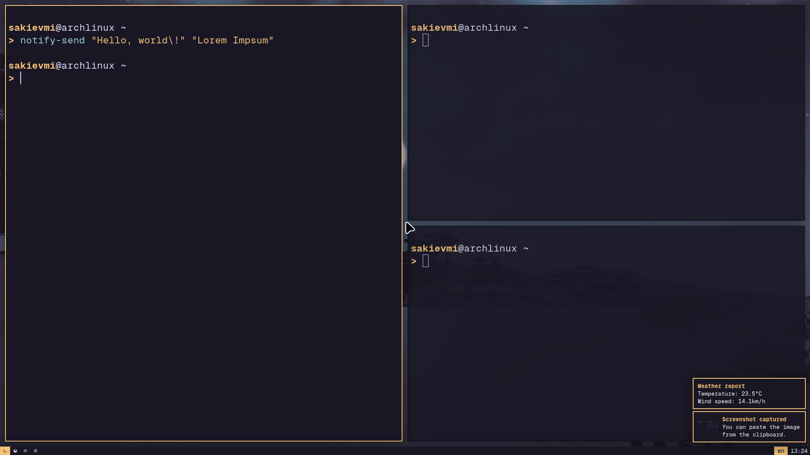
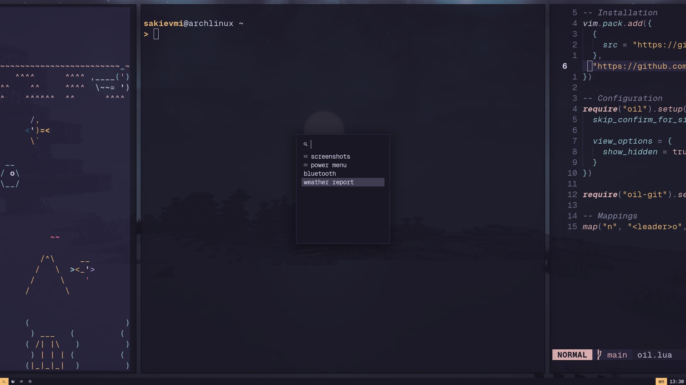

# dotfiles

### Packages
- zsh
- starship
- yazi
- niri
- fuzzel
- waybar
- foot
- dunst

### Installation and deploying
1. Install [chezmoi](https://github.com/twpayne/chezmoi).
2. Run: `chezmoi init --apply --verbose https://github.com/sakievmi-dev/dotfiles.git`
3. Done!

If you want to use these dotfiles, you should fork this repository and edit link in the command.
